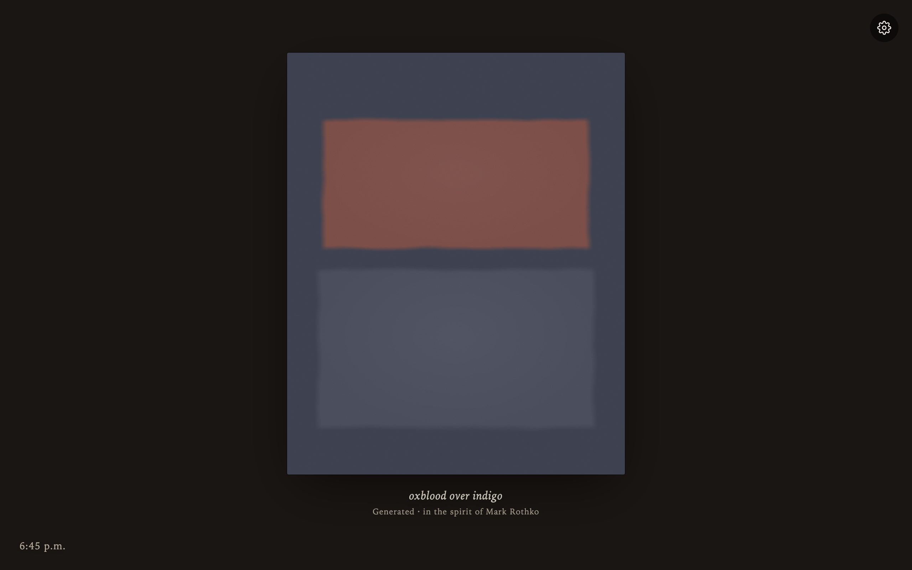

# Quiet Field

> Every new tab becomes a calm color field **in the spirit of Rothko** — original,
> procedurally generated artwork keyed to the time of day (and, optionally, your local weather).

[](./LICENSE)
&nbsp;Manifest V3 · TypeScript · Vite · zero-warning install

A Chrome/Brave/Edge extension that overrides the new-tab page. Inspired by
[Current Rothko](https://rothko.joonas.wtf/), reworked for the new-tab context: it must
paint **instantly, offline, with no flash**, leave focus in the address bar, and never
trigger an unrequested permission prompt.



---

## Highlights

- **Original generative art, not reproductions.** The default **Fields** collection is
  *generated* — six color-field composition archetypes, each in the spirit of a painter
  (Rothko, Albers, Newman, Frankenthaler, Agnes Martin, Clyfford Still) — so it's
  copyright-free and publishable with a zero-warning install.
- **Contextual.** A curated palette/register is chosen for the current time of day; opt-in
  weather refines it further. The same moment + seed always yields the same piece.
- **Instant & offline.** Paints synchronously on first frame from a `localStorage` mirror —
  no flash, no network, no async storage read on the paint path. Focus stays in the omnibox.
- **Honest attribution.** Every piece names its provenance in the caption (generated vs. a
  real painting, and who it's attributed to). See [Attribution](#attribution).
- **Accessible.** WCAG-AA contrast for captions over any artwork, `prefers-reduced-motion`
  and `prefers-color-scheme` respected.

## Collections

Three selectable collections (cog → Collection):

- **Fields** — generated color-field art. Original, copyright-free, **publishable**.
- **Abstract** — real **public-domain** abstraction, contextually matched (Kandinsky, Klee,
  Mondrian, Malevich, Hilma af Klint, late near-abstract Turner, and atmospheric PD painters).
  Sourced from Wikimedia Commons; safe to publish.
- **Hopper** — Edward Hopper, framed. **Personal/unpacked build only** — Hopper is under US
  copyright (`rights: "personal"`). See [Artwork & rights](#artwork--rights).

## Install (load unpacked)

```bash
pnpm install
pnpm build
# Chrome → chrome://extensions · Brave → brave://extensions · Edge → edge://extensions
# Enable "Developer mode" → "Load unpacked" → select ./dist
```

Open a new tab. The **Fields** collection works immediately on a fresh clone (it needs no
images). **Abstract** and **Hopper** require downloading their images first — see below.

> A plain Chromium browser (Chrome/Edge) gives the cleanest full-bleed result. Brave injects
> its own new-tab footer bar over extension new-tab pages, which the extension cannot remove.

## Develop

```bash
pnpm dev            # http://localhost:5173/newtab.html — full HMR; chrome.* is stubbed
pnpm test           # vitest — the pure core: selection, palettes, attribution, clock, rng
pnpm build          # tsc --noEmit && vite build  ->  dist/  (personal: all collections)
pnpm build:publish  # public-domain-only build (no Hopper) for the Web Store
pnpm package:publish # build:publish + zip dist/ -> quiet-field.zip
pnpm icons          # regenerate the icon set into public/icons/
```

### Painting images (Abstract + Hopper)

Downloaded images live in `public/art/stillness/` and are **not committed** (they're
reproducible artifacts; Hopper is also in copyright). The catalog metadata and curation
sources *are* committed, so regenerate the images with:

```bash
node scripts/generate-catalog.mjs   # sources in data/curation/, writes src/core/stills.ts + images
```

This downloads from Wikimedia Commons (politely, with rate-limit backoff) and downscales
locally with `sips`. The **Fields** collection is fully generated and needs no images.

## Architecture

**Pure core, impure shell.** `core/selection.ts`, `core/attribution.ts` and `render/fields.ts`
are pure and do no I/O; `newtab.ts` gathers the moment and calls them, painting synchronously
before any `await`.

```
src/
  newtab.html       critical CSS inlined; base tone from prefers-color-scheme pre-JS
  newtab.ts         impure shell: synchronous paint, then async reconcile
  core/
    rng.ts          seeded PRNG (mulberry32) — determinism
    palettes.ts     hand-curated color registers (the product)
    selection.ts    selectPiece(context, seed) — pure, testable heart
    attribution.ts  honest provenance lines (generated vs. real)
    stills.ts       generated paintings catalog (metadata only)
    types.ts
  render/
    fields.ts       soft-edged field renderer (6 archetypes; SVG turbulence + grain)
    present.ts      gallery wall, framing, caption, ambient line
    image.ts        representational renderer (focal crop)
  context/
    clock.ts        time-of-day / season / seed — no permission, no network
    weather.ts      opt-in geolocation + Open-Meteo; off the paint path
  ui/panel.ts       inline settings panel
  storage.ts        chrome.storage + synchronous localStorage mirror
```

The generative engine has **six composition archetypes**, weighted so Rothko-style `bands`
stays dominant: `bands` (Rothko), `squares` (Albers), `zips` (Newman), `veils` (Frankenthaler),
`grid` (Agnes Martin), `cleave` (Clyfford Still). Adding a seventh is a compile error until it's
handled everywhere (exhaustiveness-checked).

## Weather (opt-in)

Toggle **Match the weather** in settings: it asks for your location once, then uses
[Open-Meteo](https://open-meteo.com/) (no API key) to pick art that fits the sky, with a
`rain · 18°` line and your city in the caption. It runs entirely off the paint path — the tab
paints instantly from a cached reading, then refreshes in the background. Geolocation is an
**optional** permission — install never asks for location; the extension requests it (together
with the two weather-API hosts) only when you flip the toggle, and a denial reverts the toggle
and falls back cleanly to time-of-day.

## Attribution

Every caption states what a piece is, so a *generated* work is never mistaken for a real one
(`src/core/attribution.ts`):

- **Generated Fields** → `Generated · in the spirit of <painter>`. These are original works,
  *not* reproductions — most of those painters are still in copyright, which is exactly why we
  emulate rather than copy. (Style is not copyrightable; nothing is reproduced.)
- **Real paintings** → their actual artist, title, and year, plus a `Public domain` or
  `In copyright · personal use` provenance line.

## Artwork & rights

**The MIT [LICENSE](./LICENSE) covers the source code and the generated Fields art only — not
any third-party painting reproductions.** The separation is clean by construction:

- **No painting images are committed to this repository.** They are downloaded locally at build
  time (`scripts/generate-catalog.mjs`) onto each user's own machine. What *is* committed is
  metadata only — titles, Wikimedia filenames, years, tags — which are facts, not copyrightable.
- **Abstract** images are **public domain** (artists died 70+ years ago). Free to use and publish.
- **Hopper** images are **still under US copyright** (`rights: "personal"`). They are for the
  personal/unpacked build only and **must not be redistributed**. This is enforced, not just
  documented: **`pnpm build:publish`** narrows the selection pool to `rights === "pd"`, hides
  the Hopper edition in both settings UIs, and `scripts/prune-personal.mjs` physically deletes
  every in-copyright image from `dist/` and fails the build if any remain. (Inert catalog
  *metadata* — titles, filenames, years, i.e. facts — may remain in the JS bundle, the same way
  `stills.ts` is committed; no in-copyright **image** is ever selected, rendered, or shipped.)
- Downloads come from **Wikimedia Commons**; complying with the source's terms is the user's
  responsibility.

In short: the repository itself contains no copyrighted artwork, and the per-collection rights
above govern what you may do with images you download.

## Publishing to the Chrome Web Store

`rights: "pd"` is the single source of truth for what may be published. To prepare a store build:

```bash
pnpm package:publish   # public-domain-only build + zip -> quiet-field.zip
```

Upload `quiet-field.zip` in the [developer dashboard](https://chrome.google.com/webstore/devconsole/).
See **[STORE_LISTING.md](./STORE_LISTING.md)** for the listing copy, permission justifications,
data-use disclosures, and the asset/pre-submit checklist, and **[PRIVACY.md](./PRIVACY.md)** for
the privacy policy (host it and link its URL in the dashboard).

## Contributing

Issues and PRs welcome. Please:

1. Keep the **pure core** pure (no DOM/I/O in `core/`); the renderer stays a pure function of a piece.
2. Add tests for core logic (`pnpm test`) and keep `pnpm build` (tsc + vite) clean.
3. Don't commit downloaded images, and don't add in-copyright artwork as anything other than
   `rights: "personal"`.

## License

[MIT](./LICENSE) © 2026 Bruno Belcastro. Generated artwork is part of the licensed work;
third-party painting reproductions are not — see [Artwork & rights](#artwork--rights).
